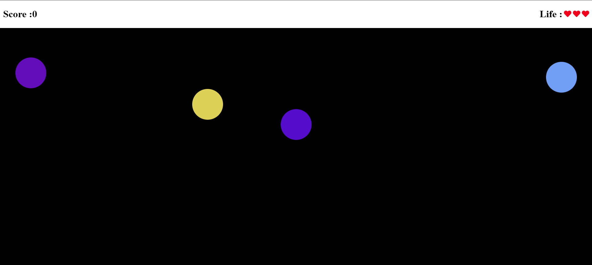

# Bubble Clicker Game

A fun and addictive bubble clicking game where you score points by clicking bubbles before they float away!



## Table of Contents

- [Game Overview](#game-overview)
- [Features](#features)
- [Gameplay Instructions](#gameplay-instructions)
- [How to Play](#how-to-play)
- [Installation](#installation)
- [Technologies Used](#technologies-used)
- [Levels and Difficulty](#levels-and-difficulty)
- [Contributing](#contributing)
- [License](#license)

## Game Overview

In Bubble Clicker, bubbles flow to the top of the screen. The goal is to click on these bubbles before they float away. Each time you successfully click a bubble, you score points, but if you let them pass, your life decreases. The game ends when you lose all your lives.

## Features

- Scoreboard displaying your current score.
- Life counter indicating how many attempts you have left.
- Bubbles that float to the top and can be clicked to score points.
- Levels that increase the speed of the bubbles as you progress.

## Gameplay Instructions

1. **Score Points**: Click on the bubbles as they float up to score 10 points for each bubble clicked.
2. **Manage Your Lives**: If you fail to click a bubble, your life will decrement. You start with a set number of lives, and the game ends when you reach 0 lives.
3. **Levels and Speed**: As you progress through the game, the speed of the bubbles will increase, making it more challenging. Try to keep up!
4. **Game Over**: The game concludes when you run out of lives. Try to achieve the highest score possible!

## How to Play

- Click on the bubbles to make them disappear and increase your score.
- Keep an eye on the life counter at the top of the screen. Don’t let too many bubbles pass you by!

## Installation

To play the Bubble Clicker game locally:

1. Clone this repository:
   ```bash
   git clone https://github.com/your-username/bubble-clicker-game.git
2. Open index.html in your web browser.

## Technologies Used

- HTML
- CSS
- JavaScript


## Levels and Difficulty
The game features multiple levels, and as you progress, the speed of the bubbles will increase, adding to the challenge. This mechanic keeps the gameplay engaging and encourages players to improve their reaction times.
Contributing
Contributions are welcome! If you want to help improve the game, please fork the repository and submit a pull request.

## License
This project is licensed under the MIT License. See the LICENSE file for details.

### Key Sections Explained:
- **Game Overview**: Describes the basic concept of the game.
- **Features**: Lists the key features that make the game enjoyable.
- **Gameplay Instructions**: Provides step-by-step instructions on how to play.
- **Installation**: Guides users on how to set up the game locally.
- **Technologies Used**: Specifies the languages and technologies used to build the game.
- **Levels and Difficulty**: Explains how the game increases in difficulty.
- **Contributing**: Encourages others to contribute to the project.
- **License**: States the license under which the project is distributed.

Feel free to modify any parts of it to better match your style or add any additional information you think might be useful! If you need further assistance or changes, just let me know.
